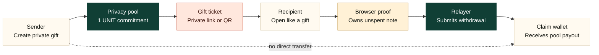
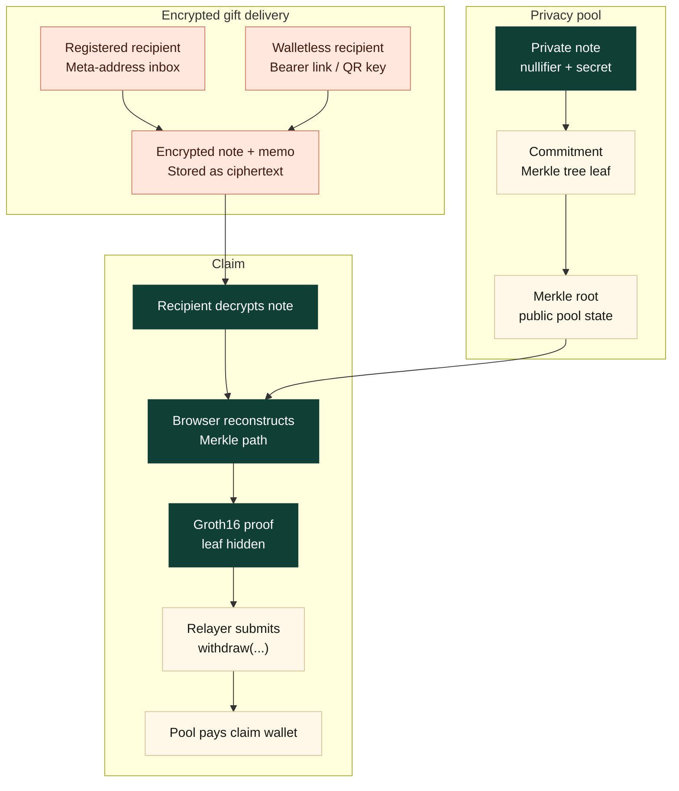
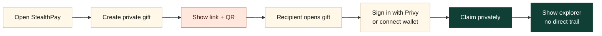
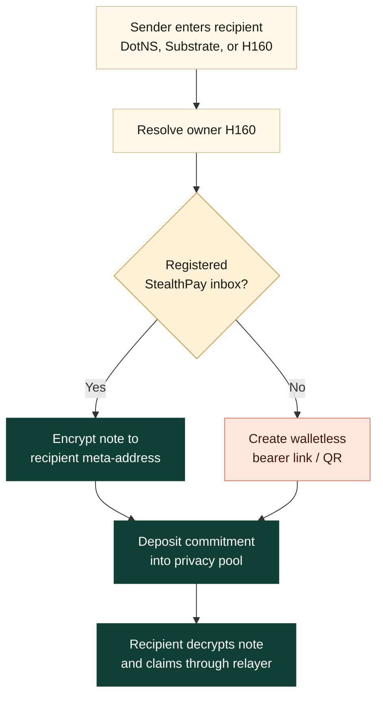
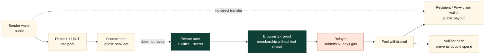

# StealthPay

Private gifts, claimed like magic.

StealthPay is a Polkadot-native private gift protocol. A sender deposits a fixed-size gift into a privacy pool, shares a private link or QR, and the recipient claims through a relayer without a direct public sender-to-recipient payment trail.

The product turns private value transfer into a consumer gift flow:

- **Send Gift**: create a 1 UNIT private gift, add an optional memo, and share it as a link or QR.
- **Walletless Claim**: recipients can claim into a Privy embedded H160 wallet with email, Google, or passkey.
- **Registered Private Wallet**: repeat recipients can register a StealthPay meta-address so senders can target them by wallet or DotNS.
- **Private Withdrawal**: the recipient's browser generates a Groth16 proof; the relayer submits proof coordinates only.
- **Explorer Story**: the chain shows sender to pool and pool to claim wallet, not sender directly to recipient.

Demo app:

```text
https://web-rouge-one-36.vercel.app
```

## Product Overview



StealthPay does not claim to hide every transaction participant. The sender's pool deposit is public, and the final pool payout is public. The privacy property is that the public chain cannot prove which deposit funded which withdrawal.

```text
Deposit side: sender -> privacy pool, commitment only
Claim side: relayer -> privacy pool -> recipient, nullifier only
Missing link: no explorer row says sender -> recipient
```

## How It Works



Core objects:

- **Commitment**: a Poseidon hash of the private note. It becomes the public pool leaf and hides the note secret, nullifier, recipient, and memo.
- **Nullifier hash**: revealed only at claim time so the pool can reject double-spends without learning which deposit leaf was spent.
- **Merkle path**: reconstructed from public `Deposit` events ordered by `leafIndex`; it proves the note exists in the pool.
- **ZK proof**: generated in the recipient's browser. It proves ownership of an unspent pool note without revealing the deposit leaf.
- **Relayer**: pays gas and submits `withdraw(...)`. It never receives the note secret, raw nullifier, bearer gift key, stealth seed, or private memo.

## Demo Flow



Suggested live walkthrough:

1. Open the app and create a walletless private gift.
2. Show the branded share card with private link and QR.
3. Open the gift link as the recipient.
4. Sign in with Privy to get a recoverable H160 claim wallet.
5. Claim through the relayer.
6. Open the explorer and show `sender -> pool`, then `pool -> claim wallet`.

Do not lead with raw cryptography. Keep the demo centered on the gift experience, then use the explorer and FAQ below for technical judges.

## Registered Recipient vs Walletless Gift



You do **not** need to register to create and send a walletless gift card. Registration is only needed when a recipient wants a reusable private inbox so senders can target them by wallet or DotNS without sharing a bearer link.

## Explorer Proof

Use this framing when explaining the demo:

```text
Deposit side: sender -> privacy pool, commitment only
Claim side: relayer -> privacy pool -> recipient, nullifier only
Missing link: no explorer row says sender -> recipient
```

The sender wallet is not hidden from the deposit transaction. The recipient wallet is not hidden from the withdrawal if the recipient claims to a public wallet. What StealthPay hides is the **payment graph**: which deposit funded which withdrawal.



Key terms:

- **Commitment**: a Poseidon hash of the private note data. The pool stores this as a Merkle tree leaf. It proves a valid 1 UNIT note exists, but it does not reveal the note secret, nullifier, recipient, or memo.
- **Nullifier hash**: a public hash revealed during claim. The pool records it so the same note cannot be spent twice. It does not reveal which deposit commitment it came from.
- **Merkle path**: the sibling hashes needed to prove the commitment is inside the pool tree. The app reconstructs this from public `Deposit` events ordered by `leafIndex`.
- **ZK proof**: generated in the recipient's browser. It proves knowledge of an unspent note in the Merkle tree without revealing the deposit leaf.
- **Relayer**: submits the withdrawal and pays gas. It receives proof coordinates and public inputs only, never the note secret, bearer gift key, stealth seed, or private memo.

For the full judge-facing walkthrough, including meta-addresses, Merkle reconstruction, proof inputs, and FAQ, see [docs/DEMO_DIAGRAMS.md](docs/DEMO_DIAGRAMS.md).

## Repository Layout

- [`web/`](web/) - React product app: Home, Wallet, Send Gift, Claim, Advanced.
- [`contracts/pvm/`](contracts/pvm/) - PVM Solidity contracts for the StealthPay registry, pool, and verifier.
- [`relayer/`](relayer/) - private withdrawal relayer, Bulletin storage sponsor, and public-event indexer.
- [`docs/`](docs/) - architecture notes, crypto walkthroughs, demo diagrams, deployment notes, and bug reports.
- [`scripts/`](scripts/) - local stack, relayer, deployment, and validation helpers.
- [`blockchain/`](blockchain/) and [`cli/`](cli/) - Polkadot runtime and CLI surfaces retained for local development and reference.

## Run Locally

For the browser demo against deployed Paseo contracts:

```bash
cd web
npm install
npm run dev
```

In a second terminal, start the local relayer/indexer:

```bash
./scripts/start-relayer.sh
```

The app reads local configuration from `web/.env.local` and relayer secrets from `.env`.

Minimum useful env values:

```bash
VITE_WS_URL=wss://asset-hub-paseo-rpc.n.dwellir.com
VITE_ETH_RPC_URL=https://services.polkadothub-rpc.com/testnet
VITE_RELAYER_URL=http://127.0.0.1:8787
VITE_PRIVY_APP_ID=<privy-app-id>
RELAYER_PRIVATE_KEY=<relayer-h160-private-key>
```

For a full local parachain/devnet run, use:

```bash
./scripts/start-all.sh
```

## Development

### Lint & format

```bash
# Rust (requires nightly for rustfmt config options)
cargo +nightly fmt              # format
cargo +nightly fmt --check      # check only
cargo clippy --workspace        # lint

# Frontend (web/)
cd web && npm run fmt           # format
cd web && npm run fmt:check     # check only
cd web && npm run lint          # eslint

# Contracts (contracts/evm/ and contracts/pvm/)
cd contracts/evm && npm run fmt
cd contracts/pvm && npm run fmt
```

### Run tests

```bash
# Pallet unit tests
cargo test -p pallet-template

# All tests including benchmarks
SKIP_PALLET_REVIVE_FIXTURES=1 cargo test --workspace --features runtime-benchmarks

# Statement Store runtime + CLI coverage
cargo test -p stack-template-runtime
cargo test -p stack-cli

# Relay-backed Statement Store smoke test
./scripts/test-statement-store-smoke.sh

# Solidity tests (local Hardhat network)
cd contracts/evm && npx hardhat test
cd contracts/pvm && npx hardhat test
```

## Documentation

- [docs/DEMO_DIAGRAMS.md](docs/DEMO_DIAGRAMS.md) - StealthPay demo diagrams, trust boundaries, and talk track
- [docs/ARCHITECTURE.md](docs/ARCHITECTURE.md) - StealthPay architecture notes and trust boundaries
- [docs/CRYPTO.md](docs/CRYPTO.md) - StealthPay crypto working spec for the implemented flows
- [docs/DEPLOYMENT.md](docs/DEPLOYMENT.md) - deployment guide for browser, Dot.li, contracts, relayer, and indexer
- [docs/BUG_REPORTS.md](docs/BUG_REPORTS.md) - stack bugs and integration surprises discovered during the build
- [docs/STEALTHPAY_JOURNEY.md](docs/STEALTHPAY_JOURNEY.md) - build retrospective and demo status
- [docs/TOOLS.md](docs/TOOLS.md) - Polkadot stack components used by the repo

## Stack

StealthPay is built on the Polkadot stack:

- `pallet-revive` / PVM smart contracts for the registry, pool, and verifier.
- Bulletin Chain for encrypted gift payload storage.
- DotNS / Dot.li as the intended Polkadot-native distribution layer.
- PAPI and viem for frontend chain interactions.
- Privy for walletless H160 claim-wallet recovery.
- Groth16 and Poseidon for the private withdrawal circuit.

## Key Versions

| Component          | Version                                 |
| ------------------ | --------------------------------------- |
| polkadot-sdk       | stable2512-3 (umbrella crate v2512.3.3) |
| polkadot           | v1.21.3 (relay chain binary)            |
| polkadot-omni-node | v1.21.3 (from stable2512-3 release)     |
| eth-rpc            | v0.12.0 (Ethereum JSON-RPC adapter)     |
| chain-spec-builder | v16.0.0                                 |
| zombienet          | v1.3.133                                |
| pallet-revive      | v0.12.2 (EVM + PVM smart contracts)     |
| Node.js            | 22.x LTS                                |
| Solidity           | v0.8.28                                 |
| resolc             | v1.0.0                                  |
| PAPI               | v1.23.3                                 |
| React              | v18.3                                   |
| viem               | v2.x                                    |
| alloy              | v1.8                                    |
| Hardhat            | v2.27+                                  |

## Resources

- [Polkadot Smart Contract Docs](https://docs.polkadot.com/smart-contracts/overview/)
- [Polkadot SDK Documentation](https://paritytech.github.io/polkadot-sdk/master/)
- [PAPI Documentation](https://papi.how/)
- [Polkadot Faucet](https://faucet.polkadot.io/) (TestNet tokens)
- [Blockscout Explorer](https://blockscout-testnet.polkadot.io/) (Polkadot TestNet)
- [Bulletin Chain Authorization](https://paritytech.github.io/polkadot-bulletin-chain/) - authorize the relayer storage-sponsor account once for app-managed encrypted payload uploads; direct user authorization remains an advanced fallback only.

## StealthPay Public Event Indexing

StealthPay does not use a private database for gifts or notes. The frontend only indexes public events:

- first: the StealthPay public indexer exposed by the relayer
- fallback: optional Blockscout address logs on Paseo
- fallback: direct `eth_getLogs`
- fallback: bounded `Revive.ContractEmitted` runtime-event decoding

Configure the hosted indexer path in `web/.env.local` if needed:

```bash
VITE_RELAYER_URL=https://stealthpay-relayer.onrender.com
VITE_STEALTHPAY_INDEXER_URL=https://stealthpay-relayer.onrender.com
```

Set `VITE_STEALTHPAY_INDEXER_KIND=none` to force direct RPC/runtime scanning.

## License

[MIT](LICENSE)
