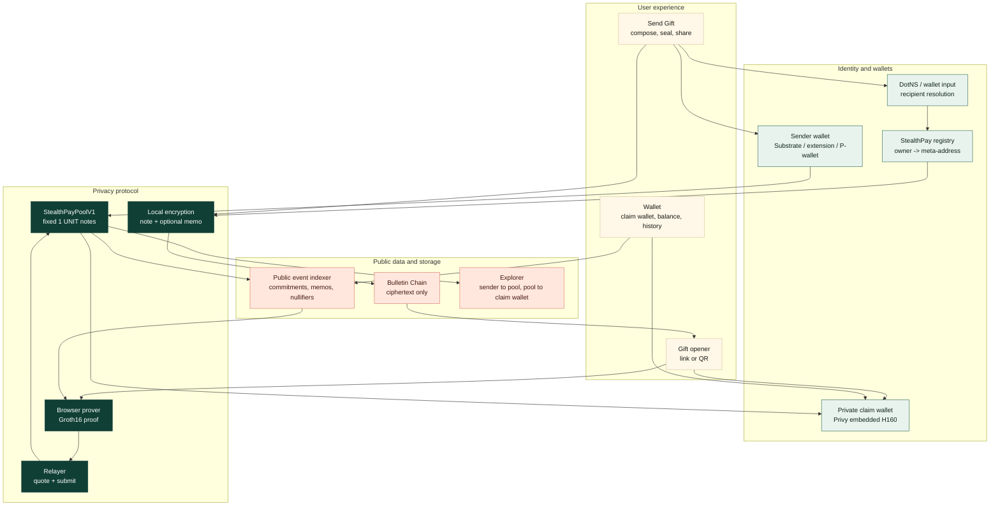
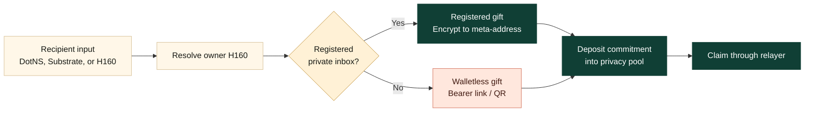
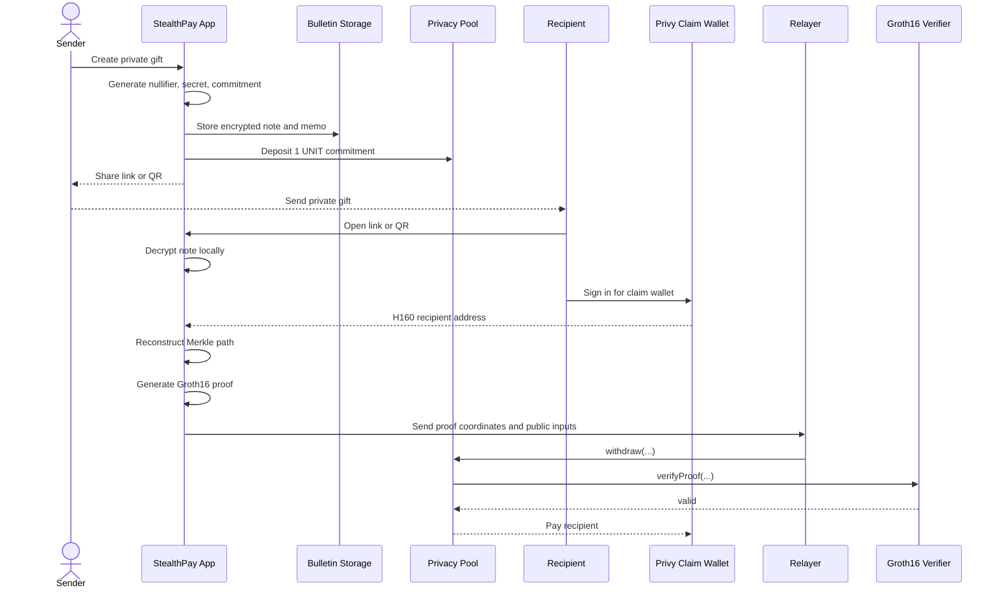

# StealthPay Architecture

StealthPay is a Polkadot-native private gift protocol. The product flow is simple:

```text
sender funds privacy pool -> recipient opens link or QR -> relayer submits private withdrawal
```

The protocol does not hide that a sender deposited into the pool or that a recipient received from the pool. It hides the payment graph: which deposit funded which withdrawal.

```text
Visible: sender -> privacy pool
Visible: privacy pool -> claim wallet
Hidden: sender -> recipient linkage
```

## Product Surface

The app exposes StealthPay through five product routes:

- `Home`: product story and primary CTAs.
- `Wallet`: private gift home, Privy claim wallet, balance, claim history, and transfer-out controls.
- `Send Gift`: create registered-recipient gifts or walletless bearer-link gifts.
- `Claim`: open a private gift link or QR and claim through the relayer.
- `Advanced`: diagnostics, recovery, and lower-level protocol tooling.

The consumer routes hide raw contract addresses, Merkle details, proof coordinates, relayer internals, and scan configuration unless the user opens advanced sections.

## Architecture Overview



## Two Gift Modes

StealthPay has two recipient modes. They use the same pool and same ZK withdrawal model, but different delivery.



### Registered Recipient

Registered mode is for recipients who want a reusable private inbox.

Flow:

1. Recipient creates or imports a dedicated StealthPay stealth seed.
2. App derives two secp256k1 public keys: spending public key and viewing public key.
3. Recipient registers the encoded meta-address under their owner H160 in the StealthPay registry.
4. Sender resolves recipient input to owner H160.
5. Sender reads `metaAddressOf(owner)`.
6. Sender encrypts the pool note to that meta-address.
7. Recipient decrypts and claims later.

Public:

- owner H160 registered a StealthPay inbox
- public meta-address keys

Private:

- stealth seed
- viewing/spending private keys
- gift note secret and nullifier
- memo text
- which deposits were intended for that inbox

Important: registration makes a recipient reachable; it does not create a direct sender-to-recipient payment.

### Walletless Bearer Link

Walletless mode is for recipients who do not have a wallet or have not registered.

Flow:

1. Sender creates a private pool note.
2. Sender encrypts it with a random high-entropy gift key.
3. Encrypted envelope is uploaded as ciphertext.
4. Link or QR carries routing metadata plus the gift key.
5. Recipient opens link, signs in with Privy, decrypts locally, and claims to the Privy embedded H160 wallet.

Security model:

- the link or QR is the claim capability until redeemed
- anyone who gets the unredeemed bearer link can claim
- this is a link-custody risk, not an on-chain privacy regression

## Deposit And Claim Flow



## On-Chain Data Model

### Deposit

For every gift, the sender creates:

```text
nullifier = random field element
secret    = random field element
commitment = Poseidon(scope, nullifier, secret)
nullifierHash = Poseidon(scope, nullifier)
```

The sender deposits exactly `1 UNIT` into the pool. The pool records the `commitment` as a Merkle tree leaf and emits:

```text
Deposit(commitment, leafIndex, root)
```

The deposit does not reveal recipient, memo, nullifier, secret, or gift key.

### Withdrawal

The recipient reveals only:

```text
nullifierHash
recipient
relayer
fee
expiry
root
Groth16 proof coordinates
```

The pool verifies that the proof is valid and that `nullifierHash` has not already been spent. It then pays the recipient and marks the nullifier as used.

## Merkle Tree And Proof Path

Each pool deposit is one leaf:

```text
leaf 0 = commitment A
leaf 1 = commitment B
leaf 2 = commitment C
...
leaf N = commitment N
```

The browser reconstructs the tree from public deposit events:

1. fetch indexed deposits by pool address
2. sort by `leafIndex`
3. rebuild the same Poseidon Merkle tree
4. find the leaf matching the decrypted note commitment
5. calculate sibling hashes and path indices

The path is private witness data for the proof. The verifier only sees the root and proof.

## Why ZK Is Used

Without ZK, the recipient would need to reveal:

```text
I am spending leaf N.
```

That would link the withdrawal back to the deposit.

With ZK, the browser proves:

```text
I know nullifier and secret.
Poseidon(scope, nullifier, secret) is inside this Merkle root.
Poseidon(scope, nullifier) equals this public nullifierHash.
This withdrawal is bound to recipient, relayer, fee, expiry, pool, and chain.
```

It does not reveal:

- note secret
- raw nullifier
- deposit leaf
- private memo
- bearer gift key
- recipient inbox used for encrypted delivery

## Relayer Trust Boundary

The relayer is a transaction submission service, not a custodian.

It receives:

- proof coordinates: `pA`, `pB`, `pC`
- public inputs: root, nullifier hash, recipient, relayer, fee, expiry

It must not receive:

- note secret
- raw nullifier
- Merkle witness as production fallback
- bearer gift key
- stealth seed
- private memo

The proof binds the recipient, relayer, fee, expiry, pool, and chain context. If the relayer changes recipient or fee, verification fails.

## Public Event Indexer

The indexer stores public chain facts only:

- announcements by `memoHash`
- deposits by `commitment`
- withdrawals by `nullifierHash`
- block number, block hash, event reference, pool, registry

It never stores:

- decrypted notes
- raw nullifiers
- note secrets
- gift keys
- stealth seeds
- wallet private keys
- plaintext memos

Frontend lookup order:

1. relayer-hosted public indexer
2. local browser cache
3. Blockscout / ETH RPC logs
4. bounded runtime-event decoding fallback

Bearer claims should not block on announcement lookup. The bearer link decrypts the note and gives the app the exact commitment. Announcement metadata is enrichment only.

## Wallet Roles

StealthPay intentionally separates wallet roles:

- **Sender wallet**: Substrate / extension / P-wallet account used to fund pool deposits and register a private inbox.
- **Private claim wallet**: Privy embedded H160 wallet used for walletless payouts.
- **Registered recipient wallet**: owner wallet whose H160 has a registered meta-address.
- **Local dev signer**: development-only fallback for local diagnostics.

Privy is the primary walletless provider. Apillon is not in the main runtime path.

## Dot.li / Triangle Host Status

The reliable demo path is the normal browser app with extension wallet plus Privy:

```text
https://web-rouge-one-36.vercel.app
```

Dot.li remains the intended Polkadot-native distribution target, but it is isolated to the host-integration branch while P-wallet signing and account mapping are investigated.

Known Dot.li-specific issue:

- unmapped P-wallet accounts must submit `Revive.map_account()` before PVM contract calls
- the mapping call appears as call data `0x6407`
- in the hosted product, the signing modal can stall on `Signing...`
- until that host signing path is stable, Dot.li is not the primary live demo route

## Current Contract Set

Paseo deployment uses:

- `StealthPay`: recipient meta-address registry and private deposit announcement
- `StealthPayPoolV1`: fixed-denomination pool, Merkle tree, nullifier tracking, withdrawal verification
- `WithdrawVerifier`: Groth16 verifier contract

The current fixed denomination is `1 UNIT`. This is intentional for the demo because equal-sized deposits preserve the anonymity set. Variable amount private balances require a UTXO / join-split design and are out of scope for this build.

## What Privacy StealthPay Provides

Provides:

- no direct public sender-to-recipient transfer
- encrypted note and memo delivery
- hidden deposit-to-withdrawal linkage
- gasless recipient claim through relayer
- walletless claiming through a recoverable embedded H160 wallet

Does not provide:

- hiding that the sender deposited into the pool
- hiding that a recipient wallet received from the pool
- amount privacy beyond fixed denomination
- protection from all timing-analysis in small anonymity sets
- privacy if the user later moves funds in a way that links wallets

## Demo One-Liner

> StealthPay makes private value transfer feel like opening a gift: the sender funds a Polkadot privacy pool, the recipient opens a link or QR, and a browser-generated ZK proof lets the relayer withdraw to the claim wallet without exposing a direct sender-to-recipient payment trail.
