# StealthPay Demo Diagrams

Use these diagrams to explain StealthPay to judges without forcing them through raw protocol screens.

Demo sentence:

> StealthPay lets someone send a private gift into a Polkadot privacy pool, share it as a link or QR, and let the recipient claim through a relayer without a direct public sender-to-recipient trail.

Current demo link:

```text
https://web-rouge-one-36.vercel.app
```

Use the Vercel browser demo for the live walkthrough. The Dot.li / Triangle version is
preserved on `dotli-host-integration`, but the current P-wallet signing flow can
stall on the required `Revive.map_account()` setup transaction for unmapped accounts.
Explain that as an honest platform-integration issue, not as a failure of the privacy
flow itself.

## 1. Product Story

```mermaid
flowchart LR
    sender["Sender\nCreates private gift"] --> pool["Privacy pool\nPublic deposit, private note"]
    pool --> share["Gift ticket\nPrivate link or QR"]
    share --> recipient["Recipient\nOpens like a gift"]
    recipient --> claim["Private claim\nRelayer withdraws to wallet"]
    claim --> receipt["Clean receipt\nPool payout, no direct trail"]

    classDef person fill:#fffaf0,stroke:#d8c8a8,color:#161914,stroke-width:1px
    classDef privateNode fill:#0e3f34,stroke:#0e3f34,color:#ffffff,stroke-width:1px
    classDef gift fill:#ffe7dd,stroke:#d67b65,color:#401910,stroke-width:1px
    classDef proof fill:#f6f0df,stroke:#b7a47d,color:#161914,stroke-width:1px

    class sender,recipient person
    class pool,claim privateNode
    class share gift
    class receipt proof
```

Talk track:

- The sender never transfers directly to the recipient.
- The link or QR is just the private claim capability.
- The public chain sees sender to pool, then pool to recipient wallet.

## 2. Final Architecture

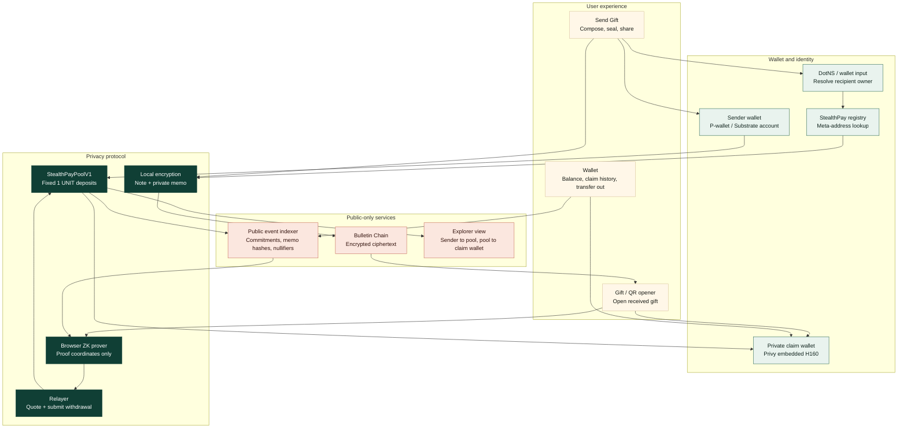

Talk track:

- The backend stores public facts and ciphertext only.
- Spend authority stays with either the registered recipient wallet or the bearer link plus claim wallet.
- Privy is recovery for the walletless H160 wallet, not protocol custody.

## 3. Walletless QR Claim Flow

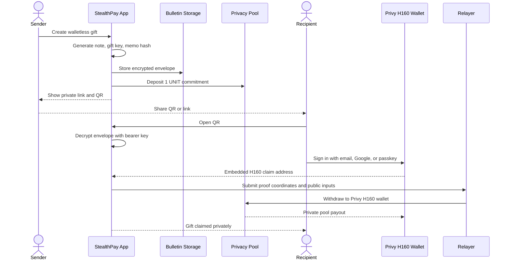

Talk track:

- Walletless does not mean custodial.
- The link or QR is sensitive until claimed, like a cash gift card.
- The recipient gets a recoverable embedded H160 wallet after social/passkey login.

## 4. Registered Recipient Flow

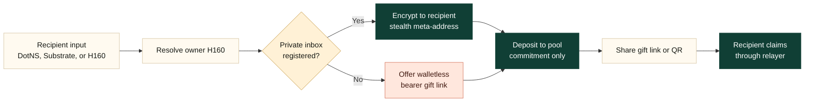

Talk track:

- Registered recipient is the strongest targeted mode.
- If the recipient has not registered, the product does not dead-end; it creates a walletless gift.
- Both paths still use the same privacy pool and private withdrawal model.

## 5. Privacy And Trust Boundaries

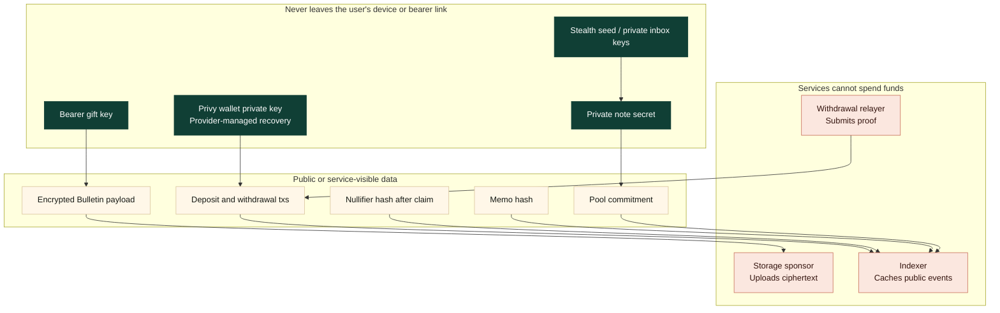

Talk track:

- The relayer does not receive note secrets.
- The storage sponsor only uploads encrypted bytes.
- The indexer stores public chain facts only.

## 6. Indexing And Claim Discovery

```mermaid
flowchart LR
    link["Gift link or QR\npool, memo, key if bearer"] --> decrypt["Decrypt note\nrecover commitment"]
    decrypt --> exact["Exact lookup\ncommitment or memo hash"]
    exact --> indexer["StealthPay indexer\nfast path"]
    indexer --> found{"Deposit found?"}
    found -->|"Yes"| proof["Build Merkle path\nGenerate proof"]
    found -->|"No"| fallback["Fallback lookup\nlocal cache, Blockscout, eth_getLogs,\nruntime events"]
    fallback --> proof
    proof --> submit["Relayer submit\nproof coordinates only"]
    submit --> done["Claim complete\nnullifier recorded"]

    classDef start fill:#ffe7dd,stroke:#d67b65,color:#401910
    classDef lookup fill:#fff7e8,stroke:#d9c49d,color:#161914
    classDef decision fill:#fff1d6,stroke:#c79b48,color:#161914
    classDef privateNode fill:#103f35,stroke:#103f35,color:#ffffff

    class link start
    class decrypt,exact,indexer,fallback lookup
    class found decision
    class proof,submit,done privateNode
```

Talk track:

- Claim should not depend on scanning a random recent block window.
- Bearer links can recover the exact commitment, so lookup should be exact and fast.
- Runtime scanning is a fallback, not the product experience.

## 7. Demo Script Map

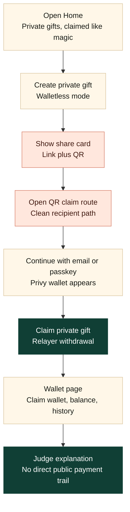

Talk track:

- Do not demo manual Bulletin authorization unless asked.
- Do not demo recovery-file flows.
- Keep Advanced open only for technical judge questions.

## 8. What We Are Doing

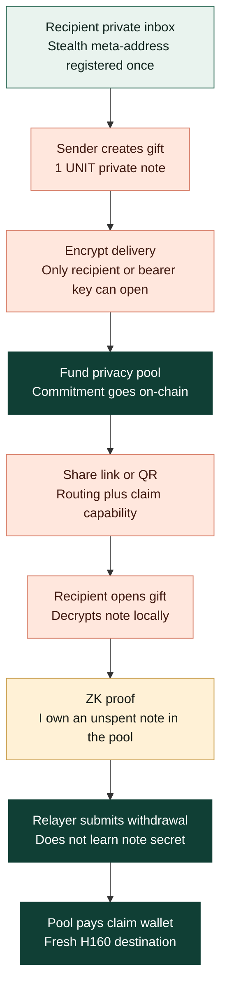

Talk track:

- We are not hiding that a deposit happened.
- We are hiding which later withdrawal belongs to which sender.
- The recipient receives the secret needed to spend a pool note, not a direct transfer from the sender.

## 9. How The User Is Hidden

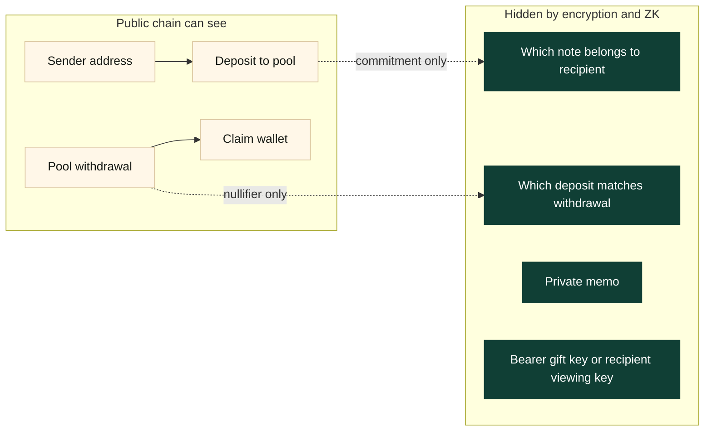

Talk track:

- The sender is visible funding the pool.
- The recipient is visible receiving from the pool.
- The missing public link is: this sender deposit equals that recipient withdrawal.

## 10. Stealth Inbox And Gift Note

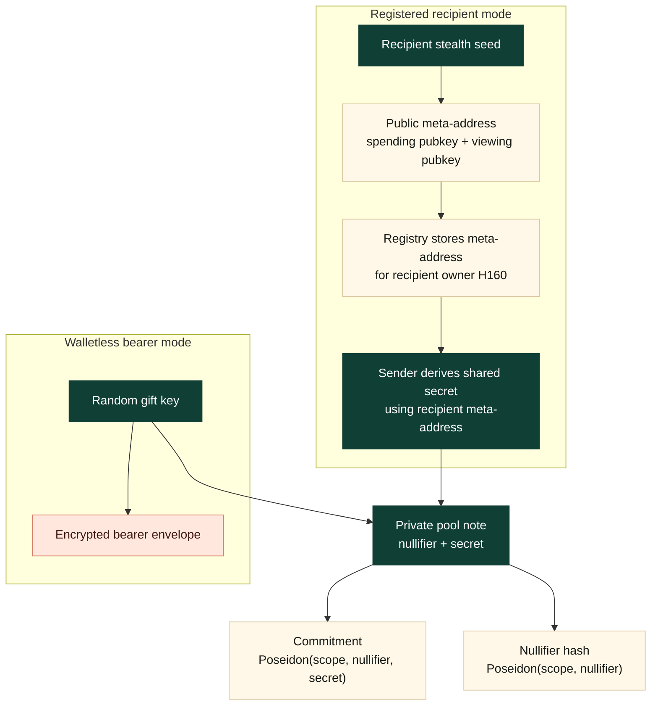

Talk track:

- Registered mode encrypts to a reusable private inbox.
- Walletless mode encrypts to a high-entropy gift key carried in the private link or QR.
- The on-chain pool only sees the commitment, not the nullifier and secret.

## 11. Why ZK Is Needed

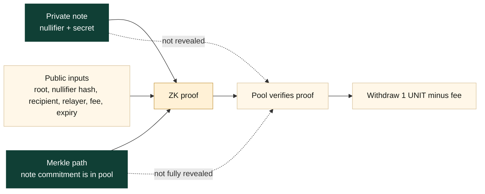

Talk track:

- Without ZK, the recipient would have to reveal exactly which deposit they are spending.
- With ZK, they prove membership in the pool without revealing the leaf.
- The nullifier prevents double-spend without revealing the original note.

## 12. What The Relayer Does

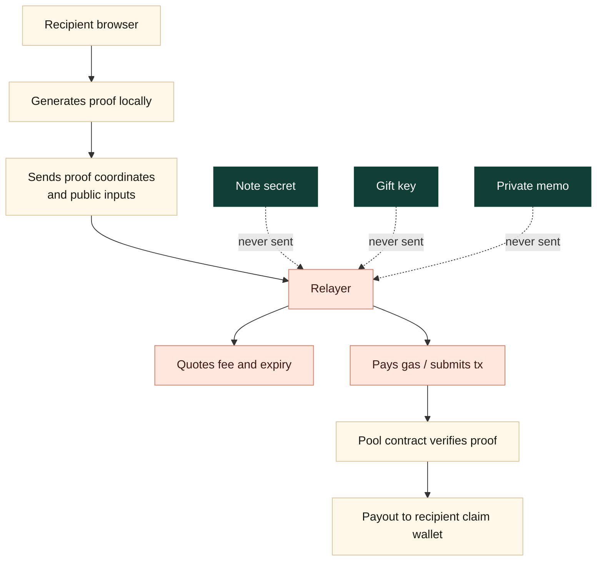

Talk track:

- The relayer improves UX by paying/submitting the withdrawal transaction.
- It cannot steal because it does not get the note secret.
- It cannot redirect because recipient, relayer, fee, and expiry are bound into the proof/public inputs.

## 13. What Judges Should Remember

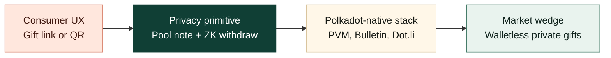

Talk track:

- The demo is a gift product.
- The core is a privacy protocol.
- The stack direction is Polkadot-native: PVM for contracts, Bulletin for encrypted delivery, and Dot.li for final distribution once the P-wallet host signing path is stable.
- The wedge is simple: private value transfer that feels like opening a gift.

## 14. Technical Explainer For Judges

This is the deeper explanation to use when judges ask how the privacy actually works.

### Meta-Address And Stealth Identity

StealthPay uses a recipient **meta-address** for registered recipients. This is not a normal funded wallet address.

In the current implementation, the meta-address is:

- a 66-byte encoded value
- made from two compressed secp256k1 public keys:
    - a spending public key
    - a viewing public key
- derived from a dedicated 32-byte StealthPay seed scoped to the chain ID
- registered on the StealthPay registry contract under the recipient owner H160

Important wording:

- It is **not** a Substrate soft-derived address.
- It is **not** a Substrate hard-derived address.
- It is **not** the parent wallet address.
- It is an application-level stealth identity.

The parent wallet is linked only in one place: the registry says this owner H160 has this public meta-address. That is intentional, because senders need somewhere public to discover how to encrypt gifts to that recipient.

What is private:

- the stealth seed
- the spending private key
- the viewing private key
- the private note secret
- the private memo

What is public:

- the owner H160 that registered
- the meta-address public keys
- the pool commitment
- the memo hash

How to explain it:

> The registered wallet publishes a public inbox, not a receiving address. Senders use that inbox to encrypt a private pool note. The chain never receives the note secret.

### Are The Generated Accounts Linked To The Parent?

There are two different ideas here:

1. **Registered private inbox**
2. **Walletless Privy claim wallet**

The registered private inbox is publicly associated with the owner in the registry, but the gifts are not direct transfers to that owner. The owner registration lets senders encrypt to the right recipient; it does not create a public sender-to-recipient payment.

The walletless Privy claim wallet is an H160 wallet created through Privy. It is the payout destination for bearer gifts. It is not derived from the sender. It is not derived from the recipient's Substrate account. It is a recoverable embedded wallet controlled through Privy login/recovery.

For the demo:

> The identity link is used for delivery, not for payment. The payment goes sender to pool, then pool to claim wallet.

### How The Gift Note Is Created

For every gift, the sender creates a fresh private note:

```text
nullifier = random field element
secret    = random field element
commitment = Poseidon(scope, nullifier, secret)
nullifierHash = Poseidon(scope, nullifier)
```

The commitment is the public pool leaf. It says “someone deposited one valid note,” but it does not reveal the nullifier or secret.

The note payload contains:

- pool address
- chain ID
- denomination
- commitment
- nullifier
- secret
- nullifier hash
- created timestamp

That note is encrypted before delivery:

- registered mode: encrypted to the recipient's private inbox using the recipient meta-address flow
- bearer mode: encrypted to a random gift key carried in the private link or QR

### How The Pool Is Funded

The sender submits a PVM `Revive.call(...)` transaction that calls:

```text
announcePrivateDeposit(pool, commitment, ephemeralPubKey, viewTag, memoHash)
```

That function:

- deposits exactly `1 UNIT` into `StealthPayPoolV1`
- inserts the commitment as a Merkle tree leaf
- emits public announcement metadata
- stores no note secret on-chain

Why fixed denomination:

- if every deposit is the same size, value does not identify the recipient
- variable amounts would shrink the anonymity set
- larger systems use UTXO / join-split private balances, but that is much more complex

For our current pool, `1 UNIT` is the anonymity ticket.

### How The Receiver Gets The Gift

Registered recipient:

1. Sender resolves recipient input: DotNS, Substrate account, or H160.
2. App resolves that to an owner H160.
3. App checks `metaAddressOf(owner)`.
4. If found, sender encrypts the note for that meta-address.
5. Recipient opens the link and uses their stealth seed to decrypt and claim.

Walletless recipient:

1. Sender creates a bearer gift.
2. Sender shares a private link or QR.
3. Link carries the gift decryption key in the hash route.
4. Recipient opens it and signs in through Privy.
5. App decrypts the note locally.
6. Withdrawal pays the Privy embedded H160 wallet.

Security wording:

> Registered gifts are targeted to a known private inbox. Walletless gifts are bearer instruments: whoever has the unredeemed link or QR can claim.

### Why Sender And Receiver Are Not Linked

A normal public payment looks like:

```text
sender -> recipient
```

StealthPay makes it:

```text
sender -> privacy pool
privacy pool -> claim wallet
```

The public chain sees both sides, but it does not know which pool withdrawal corresponds to which pool deposit.

The unlinking comes from four pieces working together:

- fixed denomination: all deposits look the same size
- commitment: deposit hides the note secret
- encrypted delivery: only the recipient / bearer link learns the note
- ZK withdrawal: spender proves the note exists without revealing which leaf they own

### Why ZK, And Why Groth16?

The pool needs to enforce two things:

1. The withdrawer owns a real deposited note.
2. The same note cannot be withdrawn twice.

Without ZK, the user would have to reveal the commitment leaf they are spending, which links the withdrawal back to the deposit.

With ZK, the browser proves:

- I know `nullifier` and `secret`
- `Poseidon(scope, nullifier, secret)` is inside the pool Merkle tree
- `Poseidon(scope, nullifier)` equals this public nullifier hash
- the withdrawal is bound to this recipient, relayer, fee, and expiry

But the proof does **not** reveal:

- the note secret
- the nullifier
- the exact leaf being spent
- the private memo
- the bearer gift key

Why Groth16:

- it is mature and widely understood
- proof verification is cheap on-chain
- verifier contracts are straightforward
- it works well for a fixed circuit like “prove membership in this Merkle tree”

Tradeoff:

- Groth16 needs trusted setup per circuit
- changing the circuit means generating new proving/verifying keys
- for a demo and fixed-denomination pool, that tradeoff is acceptable

### How Groth16 Is Used Here

The browser constructs the witness from private and public inputs.

Private witness:

- nullifier
- secret
- Merkle path elements
- Merkle path indices

Public inputs:

- Merkle root
- nullifier hash
- recipient address
- relayer address
- fee
- expiry
- pool / chain context through the circuit context binding

The browser worker generates:

```text
pA, pB, pC
```

Those are the Groth16 proof coordinates. The relayer submits only those coordinates plus public inputs to the pool contract.

The pool contract verifies the proof and then:

- marks the nullifier hash as spent
- pays the recipient
- optionally pays the relayer fee

### Why We Need A Relayer

The relayer is there for UX and privacy hygiene.

Without a relayer:

- the recipient would need gas before they can claim
- the recipient would submit the withdrawal themselves
- the funding path for that gas could create another public link

With a relayer:

- recipient can claim without pre-funding the claim wallet
- relayer pays transaction cost
- fee is included in the withdrawal quote
- proof binds recipient, relayer, fee, and expiry

The relayer cannot steal the gift because:

- it does not receive the note secret
- it does not receive the bearer key
- it does not receive the private memo
- it cannot change the recipient without invalidating the proof context

Correct one-liner:

> The relayer is a gas and submission service, not a custodian.

### What Each Component Is Responsible For

| Component | Responsibility | What it must not know |
|---|---|---|
| Sender app | Create note, encrypt delivery, fund pool | Recipient private keys |
| Bulletin | Store encrypted payload bytes | Plaintext note or memo |
| Registry | Publish recipient meta-address | Spending/viewing private keys |
| Pool contract | Hold fixed-denomination deposits, verify ZK withdrawals | Which deposit belongs to which withdrawal |
| Browser prover | Build Groth16 proof locally | N/A, runs on recipient device |
| Relayer | Quote fee and submit proof transaction | Note secret, gift key, stealth seed |
| Indexer | Cache public events for fast lookup | Private notes, memos, keys |
| Privy | Recover walletless H160 claim wallet | StealthPay protocol secrets |

### The Clean Judge Explanation

Use this if you need a 60-second technical answer:

> A registered recipient publishes a StealthPay meta-address, which is a pair of secp256k1 public keys derived from a dedicated stealth seed. It is not a funded wallet and not a Substrate soft or hard child address. The sender uses it only to encrypt a fresh private pool note. For every gift, the sender creates random note secrets, commits them with Poseidon, and deposits exactly 1 UNIT into the PVM privacy pool. The encrypted note goes to Bulletin, and the link or QR routes the recipient to the claim flow. When claiming, the browser proves with Groth16 that it knows an unspent note in the Merkle tree, without revealing which deposit it is spending. The relayer only submits the proof and pays gas; it never gets the note secret or gift key. Publicly, the explorer sees sender to pool and pool to claim wallet, but not sender directly to recipient.

## 15. Explorer Walkthrough: Proving There Is No Direct Trail

Use this section when the demo reaches the "prove it on-chain" part.

### What To Open

Open the pool contract and the two transactions:

```text
Pool contract:
0xaa27B728009493585Ea78D2eCD809f5d09f1580A

Deposit transaction or block:
sender -> pool

Claim transaction:
relayer -> pool -> claim wallet
```

If the deposit does not appear as a normal EVM-style transfer row, search by the block or inspect contract events. Deposits are submitted through Substrate `pallet-revive`, so explorers may show them under extrinsics or contract events instead of as a plain value-transfer list item.

### What The Explorer Should Show

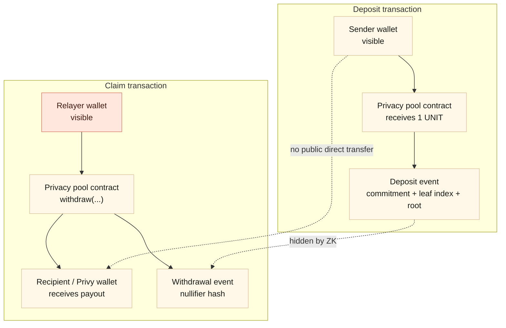

Talk track:

- "Here is the sender funding the pool."
- "Here is the relayer submitting a withdrawal from the pool."
- "Here is the recipient receiving from the pool."
- "There is no explorer row that says sender paid recipient."
- "The ZK proof proves the claimant owns some unspent pool note, but hides which deposit leaf."

### What Each Public Value Means

| Explorer value | Meaning | Does it reveal sender-to-recipient link? |
|---|---|---|
| Sender address on deposit | Who funded the pool note | No recipient shown |
| Pool address | StealthPayPoolV1 holding fixed 1 UNIT notes | Shared by all gifts |
| Commitment | Public Merkle tree leaf for a private note | Does not reveal note secret or recipient |
| Leaf index | Position of the commitment in the pool tree | Needed for proof path, not recipient identity |
| Merkle root | Tree root after deposits | Public state checkpoint |
| Relayer address on claim | Who submitted the withdrawal tx | Not the original sender |
| Recipient address on claim | Wallet paid by the pool | Sender is not shown |
| Nullifier hash | Marks note as spent | Prevents double-spend without revealing deposit leaf |

## 16. Privacy FAQ

### Are We Hiding The Depositor Wallet?

No. The depositor wallet is public on the deposit transaction.

Correct privacy statement:

```text
Visible: sender deposited into the pool.
Visible: recipient later received from the pool.
Hidden: which deposit funded which withdrawal.
```

StealthPay is payment-graph privacy, not invisibility of all activity.

### What Does "Commitment Only" Mean?

The sender creates a private note:

```text
nullifier = random field element
secret    = random field element
commitment = Poseidon(scope, nullifier, secret)
```

Only `commitment` goes into the pool as a public leaf. The nullifier and secret stay inside the encrypted note delivered to the recipient.

So the chain sees:

```text
someone deposited 1 UNIT with commitment 0x...
```

The chain does not see:

```text
recipient
memo
nullifier
secret
which wallet can claim it
```

### What Is A Nullifier?

The nullifier is the anti-double-spend secret for a note.

During claim, the browser reveals:

```text
nullifierHash = Poseidon(scope, nullifier)
```

The pool stores used nullifier hashes. If someone tries to claim the same note again, the same `nullifierHash` appears and the contract rejects it.

The important point:

```text
commitment proves money entered the pool
nullifierHash proves a note has now been spent
ZK hides which commitment produced that nullifierHash
```

### How Is The Merkle Tree Used?

Every pool deposit becomes one Merkle leaf:

```text
leaf 0 = commitment A
leaf 1 = commitment B
leaf 2 = commitment C
...
leaf N = your commitment
```

The pool stores roots for the tree. To claim, the browser reconstructs the tree from public `Deposit` events sorted by `leafIndex`.

For the user's leaf, the browser calculates the sibling path:

```text
your commitment
sibling at level 0
sibling at level 1
sibling at level 2
...
Merkle root
```

That path becomes part of the private witness for the ZK proof.

### Why Do We Need ZK?

Without ZK, the claimant would have to reveal:

```text
I am spending leaf N.
```

That would link the withdrawal to the deposit.

With ZK, the browser proves:

```text
I know nullifier and secret.
Poseidon(scope, nullifier, secret) is inside this Merkle root.
Poseidon(scope, nullifier) equals this public nullifier hash.
The withdrawal is bound to this recipient, relayer, fee, expiry, pool, and chain.
```

But it does not reveal:

```text
which leaf
note secret
raw nullifier
private memo
bearer gift key
```

### Who Generates The Proof?

The recipient's browser generates the Groth16 proof locally.

For walletless gifts:

```text
gift link key decrypts note
Privy opens the claim wallet
browser reconstructs Merkle path
browser generates Groth16 proof
relayer receives proof coordinates only
```

For registered-recipient gifts:

```text
recipient wallet unlocks stealth seed
browser decrypts matching note
browser reconstructs Merkle path
browser generates Groth16 proof
relayer receives proof coordinates only
```

### Who Verifies The Proof?

The pool contract verifies it on-chain through the Groth16 verifier contract.

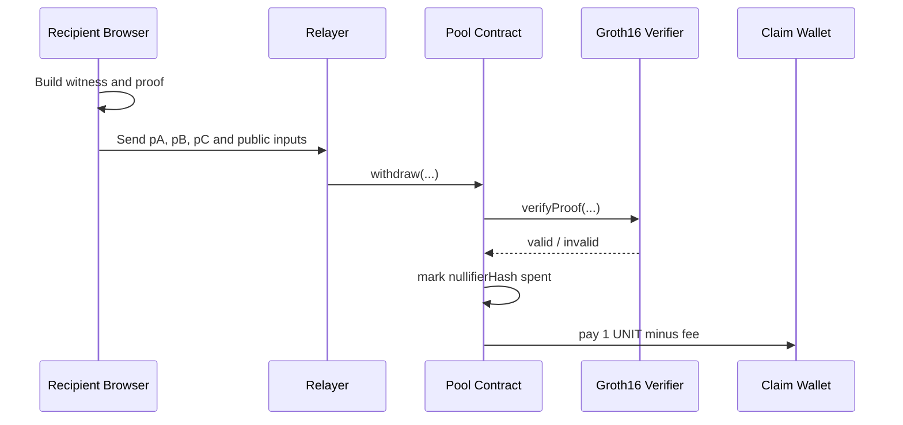

### What Does The Relayer Do?

The relayer is a gas and submission service.

It does:

- quote a fee and expiry
- submit `withdraw(...)`
- pay transaction gas
- receive its fee if the proof verifies

It does not get:

- note secret
- raw nullifier
- bearer gift key
- stealth seed
- private memo

The relayer cannot redirect the gift because recipient, relayer, fee, expiry, pool, and chain context are bound into the proof/public inputs.

### Why Can't The Recipient Submit The Proof Directly?

They can in principle, but it is worse UX and weaker privacy hygiene:

- recipient needs gas before claiming
- recipient wallet becomes the transaction sender
- funding that wallet for gas can create another public link

With a relayer:

- recipient can claim with zero pre-funded gas
- transaction sender is the relayer
- the pool pays the recipient if the proof is valid

### What Is A Stealth Meta-Address?

A StealthPay meta-address is a reusable public private-inbox key for registered recipients.

It contains public keys, not funds:

```text
spending public key
viewing public key
```

It is derived from a dedicated StealthPay seed controlled by the recipient. It is not a Substrate soft child address, not a hard child address, and not the parent wallet itself.

Purpose:

```text
sender can encrypt a private note to a recipient without asking for a fresh address each time
```

### Can A Meta-Address Be Linked To A User?

If it is registered on-chain, yes.

The registry publicly maps:

```text
owner wallet -> meta-address
```

That means a registered wallet publicly opts into having a StealthPay inbox.

What stays hidden is not the existence of the inbox. What stays hidden is:

```text
which deposits were intended for that inbox
which claims came from notes encrypted to that inbox
```

The meta-address is used for encrypted delivery, not as the on-chain payout target.

### If People Can See I Claimed From The Pool, What Is Private?

If you claim to a known public wallet, observers can see:

```text
pool -> your wallet
amount: 1 UNIT
nullifierHash: 0x...
```

They do not know:

```text
who sent it
which deposit funded it
what the private memo said
whether it was registered mode or bearer mode
```

For stronger recipient privacy in the walletless path, StealthPay defaults to a fresh Privy embedded H160 claim wallet. Then the explorer sees:

```text
pool -> fresh claim wallet
```

not your existing public wallet, unless you later move funds in a way that links them.
